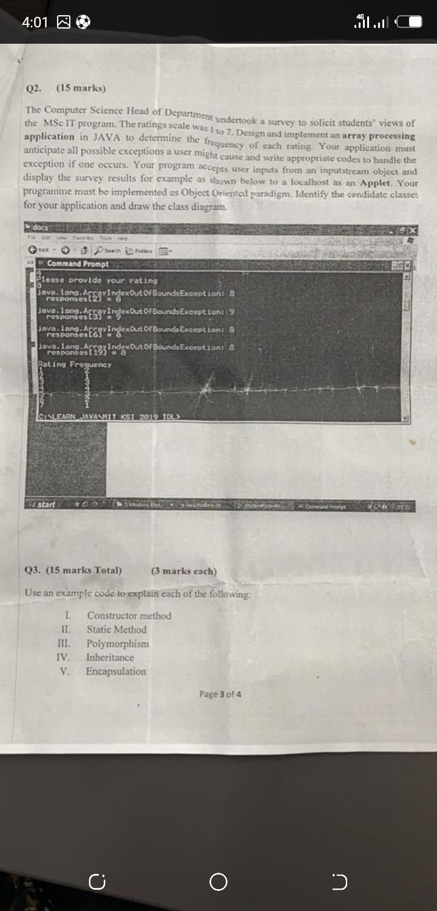

# Rating_Frequency
Display frequency of elements in array
This is an answer to a question posted in a dev group
The picture below is the picture of the problem

## How it works
* Enter any number between 1 to 7 and submit.
* Click on Results button to display the frequency of each number entered.
